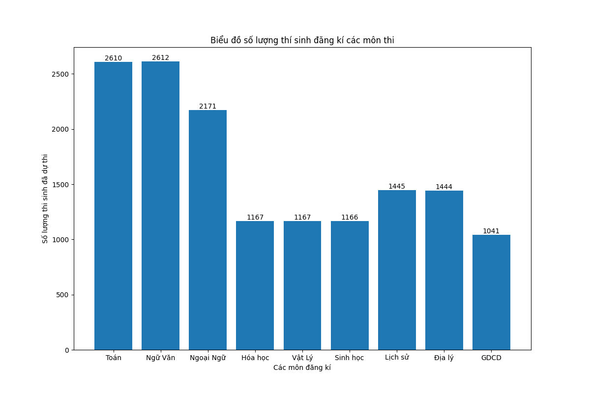
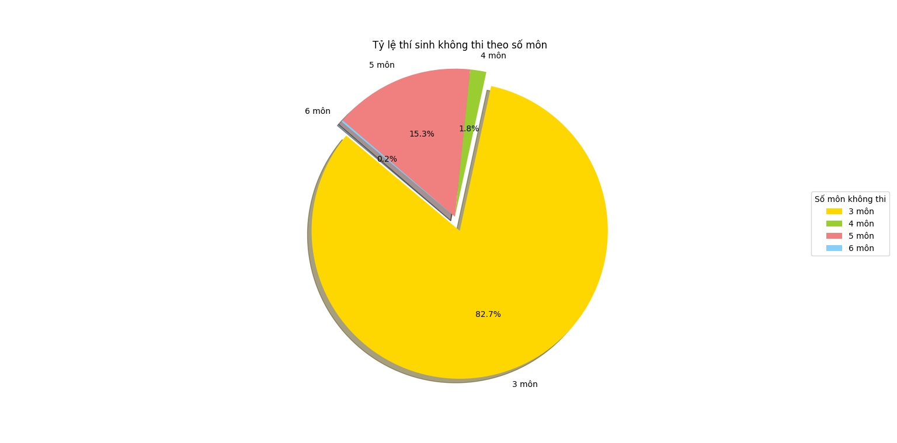
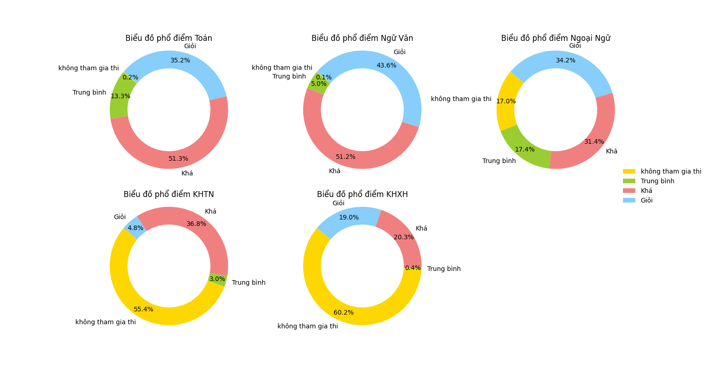

# static-THPTQG

mô tả bài toán: bài toán lấy mẫu số ngẫu nhiên là bộ điểm thi của 5000 thí sinh từ 5 vùng khác nhau trên Việt Nam: Hà Nội, TPHCM, Hải Phòng, Đà Nẵng, Nam Định. Qua nhiều bước xử lý, từ crawl dữ liệu, xử lý dữ liệu sang nhiều dạng, và output là visualize để nắm bắt được tổng quan vùng điểm của các thí sinh đến từ 5 tỉnh thành. 

__________________________________________________________________

__________________________________________________________________

